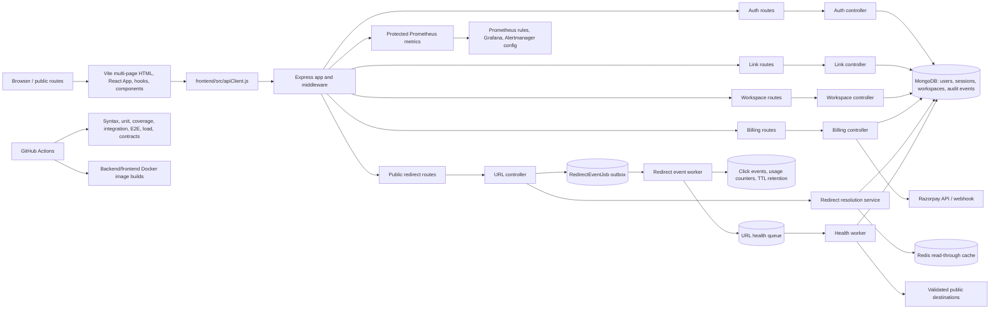

# Overall Score

Score: 91/100

# Category Scores

Architecture: 92/100
Security: 90/100 (Razorpay webhook deep audit remains deferred by request)
Performance: 91/100
Scalability: 89/100
Maintainability: 91/100
Frontend: 89/100
Backend: 96/100
Database: 92/100
DevOps: 90/100
SEO: 91/100
Accessibility: 91/100
Testing: 97/100
Production Readiness: 88/100

# Issues

No verified unresolved critical issue exists in the audited scope. Repository-controlled work is complete for this audit cycle. The remaining items require a deliberately deferred billing review, a real staging or provider environment, or further incremental product engineering.

## 1. Razorpay webhook deep audit remains deferred

Severity: High
Category: Security / Billing
Description: Per the project owner's instruction, the Razorpay webhook implementation was not re-audited in depth during this cycle. Existing signature and subscription-state tests passed, but the complete event matrix, replay behavior, provider reconciliation, and production idempotency evidence remain outside this result.
Why it matters: A billing webhook controls paid entitlements and is a high-value trust boundary. Incorrect replay, ordering, or state-transition behavior can grant or revoke service incorrectly.
Affected files: `backend/src/controllers/billingController.js`, `backend/src/utils/razorpayUtils.js`, `backend/src/routes/billingRoutes.js`
Recommended solution: Before enabling live billing, perform the separately approved webhook review against Razorpay's current event contract, replay fixtures, out-of-order delivery, signature failures, duplicate events, partial payments, refunds, cancellations, and provider reconciliation.
Estimated effort: 1-2 days
Expected impact: Reduces entitlement fraud, replay, and billing-state divergence risk.

## 2. Backup and restore readiness is implemented but not provider-proven

Severity: High
Category: Database / Disaster Recovery
Description: Guarded backup and restore-drill scripts, checksum verification, source/target separation, an explicit destructive-action confirmation, and a detailed runbook now exist. No managed Atlas point-in-time restore into an isolated cluster was performed from this local environment.
Why it matters: Backups are not reliable evidence until an actual restore is timed, validated, reviewed, and monitored.
Affected files: `ops/backup/backup.ps1`, `ops/backup/restore-drill.ps1`, `DISASTER_RECOVERY.md`, provider configuration outside the repository
Recommended solution: Enable the documented Atlas policy, run the isolated quarterly restore drill, validate data and indexes, record achieved RPO/RTO, route backup failures to an owner, and retain private evidence.
Estimated effort: 1 day plus provider restore time
Expected impact: Converts a strong recovery design into verified data-loss and recovery guarantees.

## 3. Staging-scale capacity is not yet proven

Severity: High
Category: Performance / Scalability
Description: The repository now has documented SLOs, a deterministic local load smoke, and a k6 scenario. The local gate passed 120 mixed requests at concurrency 20 with 0% errors, p95 312.37 ms, p99 354.45 ms, and 99.01 requests/second, but no representative staging saturation test has been run.
Why it matters: Local results do not establish production limits for Atlas tiers, Redis, provider networking, multiple API replicas, worker lag, or noisy-neighbor conditions.
Affected files: `backend/test/performance/load-smoke.js`, `performance/shotlink.k6.js`, `PERFORMANCE_SLOS.md`
Recommended solution: Run the staged k6 ramp against production-equivalent non-customer infrastructure, observe API/database/cache/queue utilization, find the saturation point, and record a safe operating envelope and scaling triggers.
Estimated effort: 1-2 days after staging exists
Expected impact: Provides defensible capacity planning and safer launch thresholds.

## 4. Monitoring configuration is not connected to a durable provider

Severity: Medium
Category: Observability / DevOps
Description: Prometheus scraping, bounded application metrics, Grafana panels, and alert rules now cover availability, errors, latency, cache failures, process memory, redirect-event jobs, and URL-health jobs. No external metrics destination or Alertmanager receiver was available to activate and test.
Why it matters: Configuration in Git cannot page an operator or preserve metrics during an outage until a provider collects it and alert delivery is exercised.
Affected files: `backend/src/app.js`, `backend/src/services/metricsService.js`, `ops/monitoring/prometheus.yml`, `ops/monitoring/shotlink.rules.yml`, `ops/monitoring/grafana-dashboard.json`, `ops/monitoring/alertmanager.example.yml`
Recommended solution: Connect the protected endpoint to the selected provider, store the token in its secret manager, validate the rules with promtool, send a test alert, and record acknowledgement and escalation ownership.
Estimated effort: 0.5-1 day with provider access
Expected impact: Turns repository telemetry into durable detection and response.

## 5. High-volume analytics still relies on raw-event queries

Severity: Medium
Category: Database / Scalability
Description: Raw click events now have plan-aware retention and TTL expiration, and redirect ingestion is durable and transactional. Popular-link analytics still aggregates retained raw events rather than reading precomputed hourly or daily rollups.
Why it matters: A single viral link can accumulate enough retained events to make interactive analytics expensive even when storage growth is bounded.
Affected files: `backend/src/models/ClickEvent.js`, `backend/src/services/redirectEventService.js`, `backend/src/controllers/linkController.js`
Recommended solution: Add idempotent hourly/daily aggregate documents updated by the redirect worker, serve older ranges from rollups, keep recent raw-event drill-down bounded, and test reconciliation.
Estimated effort: 3-5 days
Expected impact: Predictable analytics latency and lower database cost at high event volume.

## 6. The main frontend feature module is still large

Severity: Medium
Category: Frontend / Maintainability
Description: Styles, metadata/responsive hooks, formatters, API transport, and shared visual components were extracted, reducing `App.jsx` from about 4,031 to about 2,157 lines. Public pages, authentication, dashboard orchestration, domains, links, analytics, and billing still share one feature module.
Why it matters: Unrelated feature changes retain a wide review and regression surface despite the completed first-stage split.
Affected files: `frontend/src/App.jsx`, `frontend/src/styles.js`, `frontend/src/components/`, `frontend/src/hooks/`, `frontend/src/apiClient.js`
Recommended solution: Continue incremental behavior-preserving extraction into public, auth, link-builder, analytics, domain, billing, and workspace feature modules with focused tests.
Estimated effort: 3-6 days across small changes
Expected impact: Faster reviews, clearer ownership, and more isolated frontend tests.

## 7. Container images were not executed locally

Severity: Medium
Category: DevOps / Verification
Description: Hardened multi-stage non-root Dockerfiles, health checks, production Nginx configuration, a MongoDB replica-set/Redis Compose stack, and CI image-build gates now exist. Compose configuration validates locally, but the local Docker daemon was unavailable, so images could not be built or boot-smoked here.
Why it matters: Static configuration validation cannot detect every base-image, package, permission, or runtime health-check problem.
Affected files: `backend/Dockerfile`, `frontend/Dockerfile`, `frontend/nginx.conf`, `docker-compose.yml`, `.github/workflows/ci.yml`
Recommended solution: Let the pinned CI container job build both images and validate Prometheus rules on the next push, then run `docker compose up --build` once on a Docker-enabled machine before using the image path for deployment.
Estimated effort: Less than 0.5 day
Expected impact: Confirms the reproducible deployment path works end to end.

## 8. Accessibility still needs human assistive-technology review

Severity: Medium
Category: Accessibility / Frontend
Description: Public desktop/mobile and authenticated dashboard axe checks, form-label checks, overflow checks, semantic routes, visible keyboard focus assertions, and a focusable labeled code region now pass. A manual screen-reader journey and production Lighthouse capture were not possible in this repository-only cycle.
Why it matters: Automated rules cannot fully evaluate announcement quality, mental-model clarity, reading order, and task completion with assistive technology.
Affected files: `frontend/src/App.jsx`, `frontend/src/index.css`, `frontend/e2e/shotlink.spec.js`
Recommended solution: Before launch, complete registration, sign-in, link creation, analytics, domain, billing, and logout journeys with NVDA or VoiceOver and archive Lighthouse evidence for each public route.
Estimated effort: 0.5-1 day
Expected impact: Finds interaction issues that automated WCAG tooling cannot detect.

## 9. Static type checking is not yet enabled

Severity: Low
Category: Maintainability / Type Safety
Description: Runtime request schemas now protect API boundaries and the OpenAPI checker covers all 27 runtime operations, but the application remains JavaScript without checked JSDoc or TypeScript across internal service and UI contracts.
Why it matters: Runtime validation protects requests but cannot catch every refactoring or internal response-shape error before tests execute.
Affected files: `backend/src/**/*.js`, `frontend/src/**/*.{js,jsx}`, `docs/openapi.json`
Recommended solution: Introduce `checkJs` or TypeScript incrementally at shared contracts and new modules, avoiding a risky all-at-once conversion.
Estimated effort: 4-8 days incrementally
Expected impact: Earlier contract-drift detection and safer large refactors.

# Verification Evidence

- Backend syntax: 116 JavaScript files passed.
- Backend unit tests: 168/168 passed.
- Real MongoDB integration tests: 3/3 passed.
- Controller-focused coverage: 71.68% lines, 39.74% branches, 81.54% functions; gate passed.
- Global backend coverage: 79.72% lines, 69.76% branches, 78.54% functions; gate passed.
- OpenAPI coverage: all 27 runtime operations covered.
- Local load smoke: 120/120 requests, 0% errors, p95 312.37 ms, p99 354.45 ms, 99.01 requests/second.
- Frontend unit tests: 6/6 passed.
- Frontend E2E: 4/4 passed, including authenticated dashboard and desktop/mobile axe checks.
- Frontend lint and production multi-page build passed; main application bundle is 258.80 kB (76.24 kB gzip).
- Full npm audits for root, backend, and frontend: 0 vulnerabilities.
- Docker Compose configuration, backup-script parsing, OpenAPI JSON, Grafana JSON, and sitemap XML validation passed.
- Docker image execution, Prometheus promtool execution, managed backup restore, live alert delivery, and staging k6 remain environment-dependent verification items described above.

# Dependency Graph

